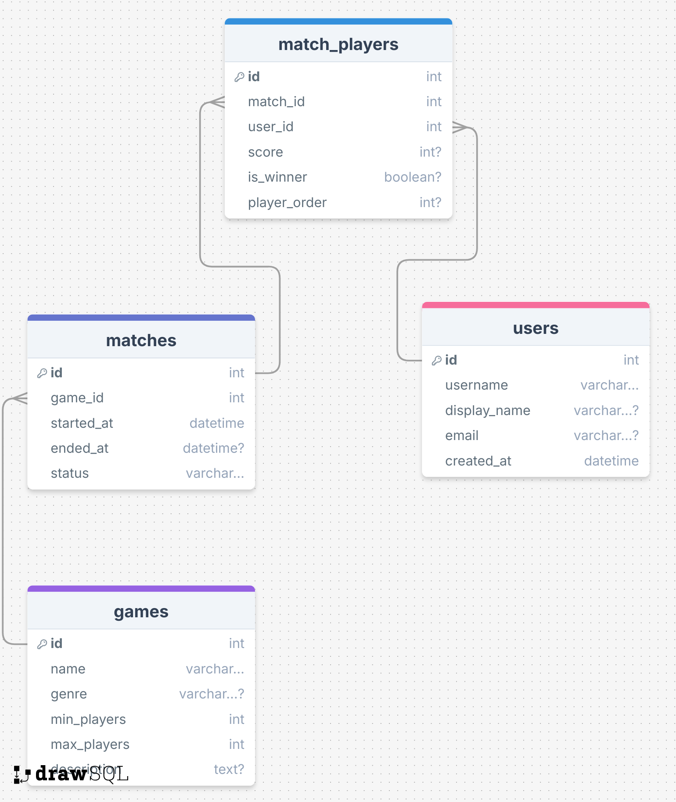
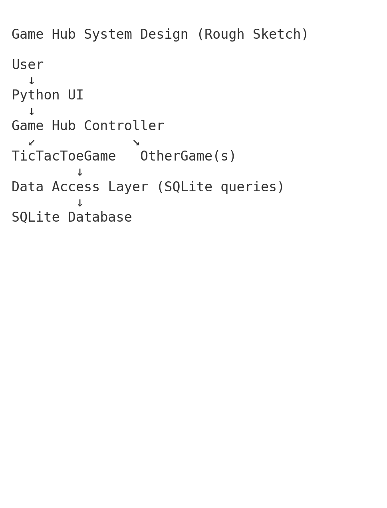

## Project Purpose/Goals
We want to make a game hub with simple multiplayer games you can play against your friends. We want to be able to compare total wins, history of specific matchups, longest win streak, etc. We are going to start with connect 4 and see how that goes, then move on to games like battleship, checkers, roulette, uno, etc.

## ERD Diagram

## System Design Rough Sketch

## Goals
# Week 1
    - Brainstorm ideas
    - Setup github
    - Research database options
# Week 2
    - Set up connect 4
# Week 3 
    - Set up game select screen
    - Set up login screen
    - Set up wins database

# Week 4
    - Add leaderboard screens
    - Add any additional games